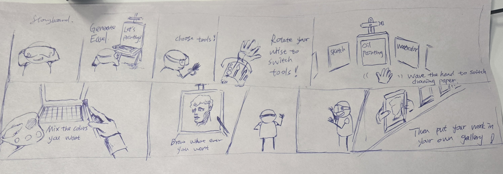

(image2.png)
This week, I learned some basic Unity operations and development workflows. Although my background is in art and game design, my understanding of Unity was previously incomplete. This course has helped me review and consolidate the foundational concepts of the engine, including project creation, scene setup, and object manipulation.

In the studio session, I created a storyboard for my prototype. The storyboard clearly demonstrates the core interactions and flow of my planned XR application, allowing me to communicate my idea effectively to others. This step gave me a better vision of the final concept and how to present it during testing and feedback sessions.