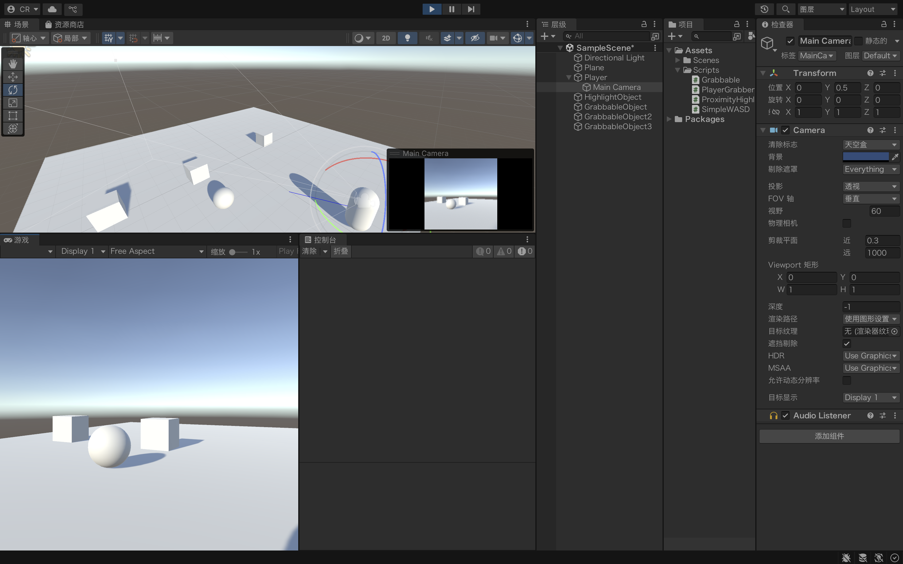

This week, I learned how to control character movement, as well as how to grab and throw objects in Unity. These practical exercises gave me a clearer understanding of how coding directly drives interactivity in immersive environments.
In my undergraduate studies, my Unity experience was more limited and leaned towards the art/design side rather than programming. Because of this, I found the coding focus in class and the textbook particularly valuable—it helped me bridge the gap between creative design and technical implementation.
Additionally, with the assistance of AI tools, I was able to better understand and apply Unity scripting concepts. This support not only improved my efficiency but also boosted my confidence in tackling the coding aspects of interaction design.
