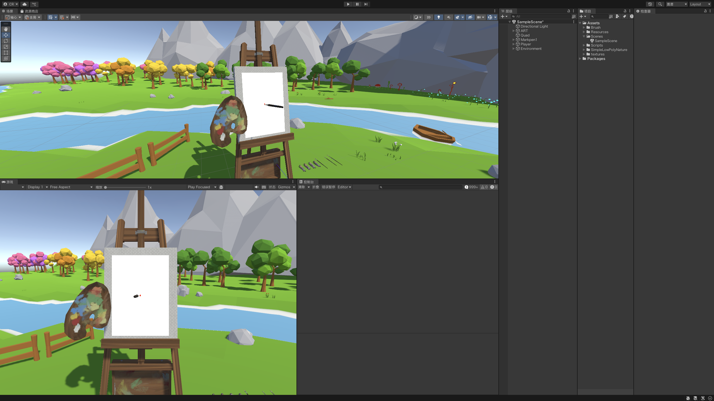

This week, I made initial progress on completing my prototype concept. I originally aimed to implement a paint-mixing system, but after an overnight attempt I still could not fully resolve the issue. For now, I replaced it with a simple color-picking function as a temporary solution.
The pen interaction logic has been adapted to XR, although presenting it on a desktop environment is still inconvenient. The scene setup and models are based on public assets, and most of the code was assisted by AI. In that sense, my main contribution was to develop and demonstrate the creative idea.
Even so, I feel a sense of achievement in being able to work through the entire workflow on my own, from concept to code to prototype. It was challenging, but rewarding, and it gave me a clearer picture of how to connect design ideas with technical execution.
