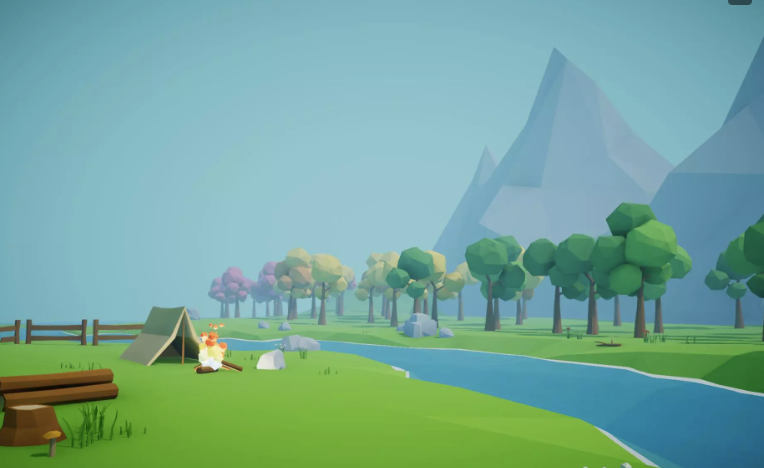
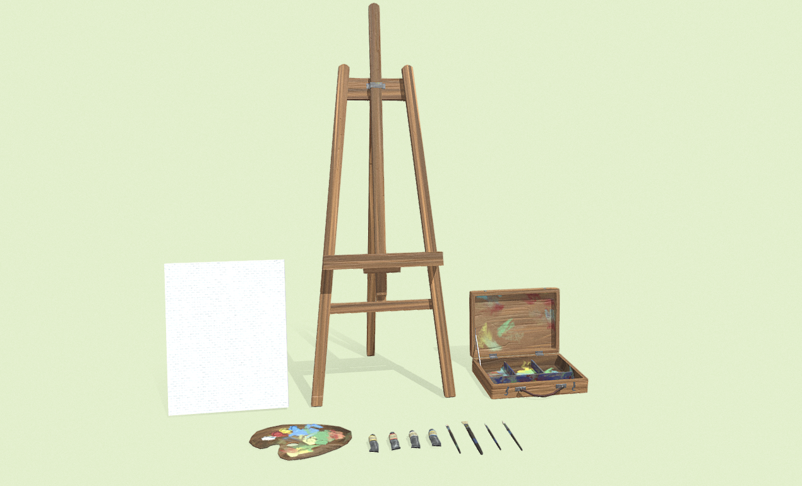

# Statement of Originality

I certify that the following components used in the creation of this prototype are my own original work unless otherwise stated.  

## Original Work
- Unity project setup and integration  
- Prototype design, interaction logic, and overall implementation (with AI support for coding guidance)  
- Modifications to imported assets to suit the prototype context  

## External Sources
The following assets were sourced externally and appropriately referenced:

1. **Environment Scene**  
   - Source: [Simple Low Poly Nature Pack](https://assetstore.unity.com/packages/3d/environments/landscapes/simple-low-poly-nature-pack-157552)  
   - Author: PolyToots (Unity Asset Store, Free)  
   - Usage: Imported as the main scene environment, with minor modifications  
   - Screenshot:  
     

2. **Painting Prop Set**  
   - Source: [Painting Prop Set](https://sketchfab.com/3d-models/painting-prop-set-326ffd761e6a41968d2b6448928521b3)  
   - Author: Sketchfab community (Free)  
   - Usage: Imported and slightly rearranged to form the painting toolkit within the prototype  
   - Screenshot:  
     

3. **Code (General Implementation)**  
   - Assisted and guided by **ChatGPT (OpenAI)**  
   - Usage: Code was written under AI assistance, with integration, debugging, and adaptation done by me  

## Notes
- All other assets, structure, and design decisions are original work.  
- External sources have been modified and integrated into the prototype context to ensure originality in design and function.  
