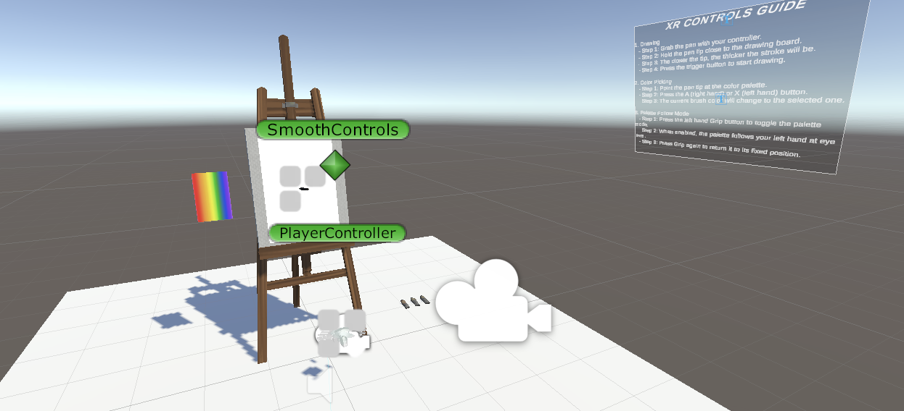
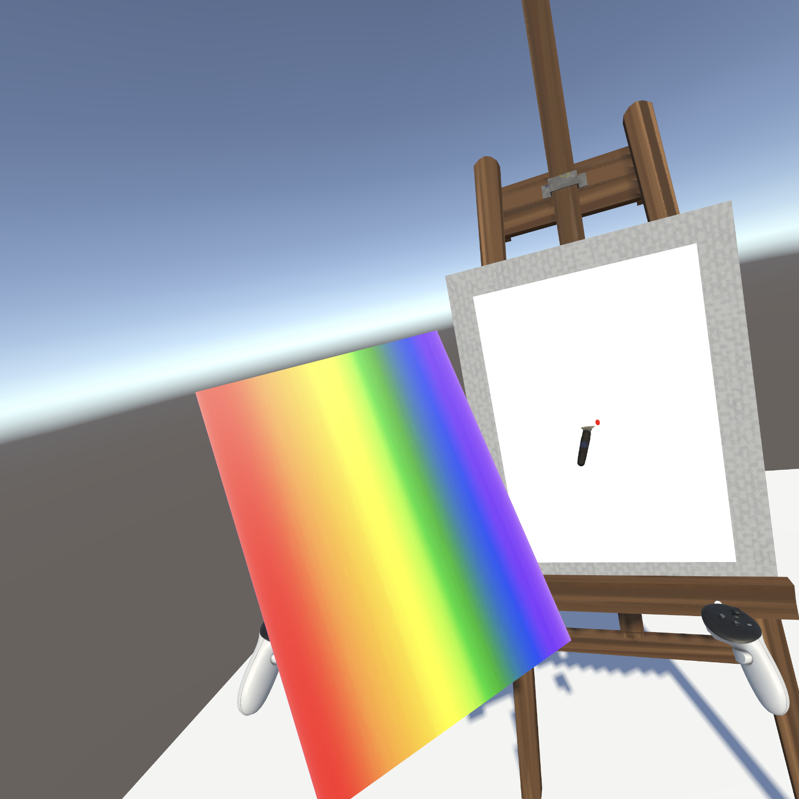

# Statement of Originality

I certify that the following components used in the creation of this prototype are my own original work unless otherwise stated.  

---

## Original Work
- Unity project setup and configuration for XR  
- Prototype design, scene layout, and interaction logic  
- Code implementation with AI assistance for guidance and debugging  
  *(AI mainly served as a teaching and error-correction tool, while integration, adaptation, and testing were performed by me)*  
- Adjustments to imported assets and scripts to fit the prototype requirements  

---

## External Sources  

### VR Prototype Scene  
- **Source:** Painting Prop Set (Sketchfab community, Free)  
- **Author:** Sketchfab community  
- **Usage:** Imported as VR props (pen, palette, and board), rearranged and integrated with custom scripts for interaction  

---

## Code Support (General Implementation)  
- **Assisted by:** ChatGPT (OpenAI)  
- **Usage:** AI was used for code suggestions, explanations, and debugging support. All integration, adjustments, and testing were done independently by me.  

---

## Screenshots  
- Unity Scene Setup  
    

- VR Runtime Example  
    

---

## Notes  
- All other assets, project structure, and design decisions are original work.  
- External sources were modified and integrated into the prototype to ensure originality in both design and functionality.  
