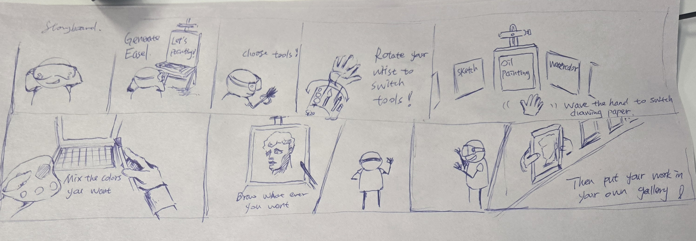

Assessment 1.1 – XR Design Concept Report
1. Application Selection and Background
This project focuses on redesigning the Procreate application for XR, categorized under Creation.
There are three key reasons for this choice:
•	Accessibility for general users: While the barrier to entry for painting is low, professional art supplies are often expensive (e.g., a single tube of high-quality paint can cost over AUD 100), making it difficult for ordinary users to experience the full charm of working with complete sets of materials. XR offers a virtual alternative, enabling users to explore professional tools without worrying about cost or mess.
•	Enhanced experience for professional users: Existing digital painting applications offer strong innovation in functionality but often fall short in simulating the physical qualities and techniques of traditional painting.
•	Innovative differentiation: This design specifically incorporates the technique of color separation (known as "藏色" in traditional painting), which involves leaving pigments partially unmixed to enrich visual layers and create a more expressive effect. Though widely used in real-world painting, this technique is rarely supported in current digital tools. Integrating it into XR interactions enhances realism and brings users closer to traditional painting logic and texture.
2. User Tasks and Goals
The core goal of this XR application is to enable users to complete a full painting workflow in an immersive environment, catering to both amateur enthusiasts and professional artists. The key tasks and corresponding user goals are as follows:
1.	Selecting canvas material:
Users can wave their right hand to switch between various types of virtual paper, such as oil canvas, watercolor paper, or sketching paper. Each material affects how the paint behaves and ultimately changes the visual outcome.
Goal: To allow users to choose the most appropriate canvas based on their artistic needs and preferred style.
2.	Color mixing and tool preparation:
By rotating the wrist, users summon a virtual toolbar to select tools like brushes or palette knives and adjust parameters such as brush size and opacity. They can then dip tools into color palettes and mix pigments either partially (“color layering”) or fully.
Goal: To help users construct their desired color palette and toolset freely, preparing them for the creative process.
3.	Painting:
With tools selected, users can freely draw or paint on the virtual canvas. The system supports stroke variations based on hand pressure and movement speed, enabling rich texture and detail.
Goal: To provide realistic and controllable painting actions that allow users to fully immerse themselves in the creative experience.
4.	Displaying artwork:
After completing a painting, the user stands up, and the system automatically hangs the artwork in a virtual personal gallery, displaying pieces in chronological order.
Goal: To give users a sense of completion and personal space to view and reflect on their creations over time.
These tasks form the core flow of the XR painting experience. Each is closely tied to spatial interaction and immersion, fulfilling the basic expectations of a creation tool while introducing novel ways of interacting through gestures and embodied actions in XR.
3. Concept Development and Iteration
In the initial design, users accessed brushes and tools from a drawer built into the easel. While this workflow was simple and realistic, precise object grabbing in XR proved to be difficult and inefficient.
During later iterations, the drawer was replaced with a more intuitive interaction: rotating the wrist to summon a virtual toolbar, allowing the user to select or adjust tools directly with the opposite hand. These changes improved interaction fluency and tracking accuracy.
These changes were made to improve interaction efficiency, visual realism, and user immersion. The final concept evolved step by step from the early Week 1 sketches.
4. XR Concept Visualization (Storyboard)
The storyboard below illustrates the complete interaction flow within the virtual studio, including environment setup, tool switching, color mixing, painting, and artwork display. It visually summarizes the XR concept and interaction design described in Section 2.

 
5. Initial Testing Plan
a. Testing Objective:
The goal of this test is to evaluate whether the designed interaction flow aligns with user intuition—specifically, whether users can independently complete the painting process without any explanations or guidance.
b. Assumptions:
•	Users will naturally understand gestures such as rotating the wrist to summon tools, waving to switch canvases, and standing up to display the artwork—without additional prompts.
•	The overall workflow is operable and understandable even for users with no prior painting experience.
c. Testing Method:
During class, I conducted initial tests using storyboards and the Wizard of Oz method with peers, who were able to complete the tasks smoothly. However, these methods introduced a certain degree of guidance.
To better evaluate whether the interactions are truly intuitive, I plan to create a low-fidelity paper prototype simulating the headset and gestures. Participants will use the setup without any instruction. The testing will focus on:
Whether users can independently understand and perform each step; Whether confusion or errors occur during interactions; Whether users provide feedback indicating unnatural or unintuitive design.
AI Usage Statement
Part of the content in this report, including language refinement and translation from Chinese to English, was assisted by AI tools (ChatGPT by OpenAI). The conceptual development, ideas, and original design were independently created by the student. All AI-assisted sections have been critically reviewed and edited to ensure personal understanding and academic integrity.
